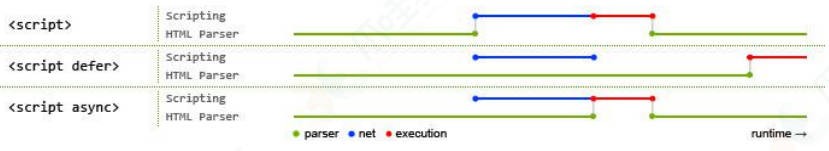

# 面试题

基础短题位置

## 对 HTML 语义化的理解

[语义化](/html/semantic)

## DOCTYPE(⽂档类型) 的作⽤

> `DOCTYPE` 是 `HTML5` 中一种标准通用标记语言的文档类型声明, 它的目
> 的是告诉浏览器(解析器)应该以什么样(`html` 或 `xhtml`)的文档类
> 型定义来解析文档, 不同的渲染模式会影响浏览器对 CSS 代码甚⾄ JavaScript 脚本的解析。  
> <span class="cor-da">它必须声明在 HTML ⽂档的第⼀⾏。</span>
> 浏览器渲染页面的两种模式
>
> 可通过 `document.compatMode`获取
>
> `CSS1Compat`: <span class="cor-tip">标准模式(Strick mode)</span>  
> 默认模式, 浏览器使用 W3C 的标准解析渲染页面。  
> 在标准模式中, 浏览器以其支持的最高标准呈现页面。
>
> `BackCompat`: <span class="cor-wa">怪异模式(混杂模式)(Quick mode)</span>  
> 浏览器使用自己的怪异模式解析渲染页面。  
> 在怪异模式中, 页面以一种比较宽松的向后兼容的方式显示。

## script 标签中 defer 和 async 的区别

> 如果没有 defer 或 async 属性, 浏览器会立即加载并执行相应的脚本。
> 它不会等待后续加载的文档元素, 读取到就会开始加载和执行, 这样
> 就阻塞了后续文档的加载。

下图可以直观的看出三者之间的区别:



其中 <span class="cor-in">蓝色</span> 代表 `js` 脚本`网络加载时间`, <span class="cor-da">红色</span> 代表 `js` 脚本`执行时间`, <span class="cor-tip">绿
色</span> 代表 `html 解析`。

defer 和 async 属性都是去异步加载外部的 JS 脚本文件, 它们都不会阻塞页面的解析, 其区别如下:

- 执行顺序
  - 多个带 `async` 属性的标签, 不能保证加载的顺序
  - 多个带 `defer` 属性的标签, 按照加载顺序执行
- 脚本是否并行执行
  - `async` 属性, 表示后续文档的加载和执行与 js 脚本的加载和执行是并行进行的, 即异步执行
  - `defer` 属性, 加载后续文档的过程和 js 脚本的加载(此时仅加载不执行)是并行进行的(异步), js 脚本需要等到文档所有元素解析完成之后,
    DOMContentLoaded 事件触发执行之前, 才执行.

## 行内元素有哪些？块级元素有哪些？ 空(void)元素有那些？

```markdown
行内元素有: a b span img input select strong；
块级元素有: div ul ol li dl dt dd h1 h2 h3 h4 h5 h6 p；
空元素, 即没有内容的 HTML 元素。空元素是在开始标签中关闭的,
也就是空元素没有闭合标签:
常见的有: <br>、<hr>、、<input>、<link>、<meta>；
鲜见的有: <area>、<base>、<col>、<colgroup>、<command>、<embed>、
<keygen>、<param>、<source>、<track>、<wbr>。
```

## 浏览器是如何对 HTML5 的离线储存资源进行管理和加载？

[MDN Manifest](https://developer.mozilla.org/zh-CN/docs/Web/Manifest)

在线的情况下, 浏览器发现 `html` 头部有 `manifest` 属性, 它会请求
`manifest` 文件, 如果是第一次访问页面 , 那么浏览器就会根据
`manifest` 文件的内容下载相应的资源并且进行离线存储。如果已经
访问过页面并且资源已经进行离线存储了, 那么浏览器就会使用离线
的资源加载页面, 然后浏览器会对比新的 `manifest` 文件与旧的
`manifest` 文件, 如果文件没有发生改变, 就不做任何操作, 如果文
件改变了, 就会重新下载文件中的资源并进行离线存储。
离线的情况下, 浏览器会直接使用离线存储的资源。

## Canvas 和 SVG 的区别

### SVG

> SVG 可缩放矢量图形（Scalable Vector Graphics）是基于可扩展标
> 记语言 XML 描述的 2D 图形的语言, SVG 基于 XML 就意味着 SVG DOM
> 中的每个元素都是可用的, 可以为某个元素附加 Javascript 事件处
> 理器。在 SVG 中, 每个被绘制的图形均被视为对象。如果 SVG 对象
> 的属性发生变化, 那么浏览器能够自动重现图形。

- 其特点如下:
  - 不依赖分辨率
  - 支持事件处理器
  - 最适合带有大型渲染区域的应用程序（比如谷歌地图）
  - 复杂度高会减慢渲染速度（任何过度使用 DOM 的应用都不快）
  - 不适合游戏应用

### Canvas

> Canvas 是画布, 通过 Javascript 来绘制 2D 图形, 是逐像素进行渲
> 染的。其位置发生改变, 就会重新进行绘制。

- 其特点如下:
  - 依赖分辨率
  - 不支持事件处理器
  - 弱的文本渲染能力
  - 能够以 .png 或 .jpg 格式保存结果图像
  - 最适合图像密集型的游戏, 其中的许多对象会被频繁重绘

::: tip 提示
注: 矢量图, 也称为面向对象的图像或绘图图像, 在数学上定义为一
系列由线连接的点。矢量文件中的图形元素称为对象。每个对象都是
一个自成一体的实体, 它具有颜色、形状、轮廓、大小和屏幕位置等
属性。
:::

## 说一下 HTML5 drag API

- `dragstart`: 事件主体是被拖放元素, 在开始拖放被拖放元素时触发。
- `darg`: 事件主体是被拖放元素, 在正在拖放被拖放元素时触发。
- `dragenter`: 事件主体是目标元素, 在被拖放元素进入某元素时触发。
- `dragover`: 事件主体是目标元素, 在被拖放在某元素内移动时触发。
- `dragleave`: 事件主体是目标元素, 在被拖放元素移出目标元素是触发。
- `drop`: 事件主体是目标元素, 在目标元素完全接受被拖放元素时触发。
- `dragend`: 事件主体是被拖放元素, 在整个拖放操作结束时触发。
