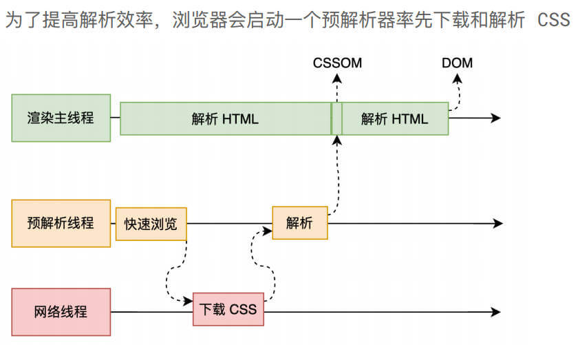
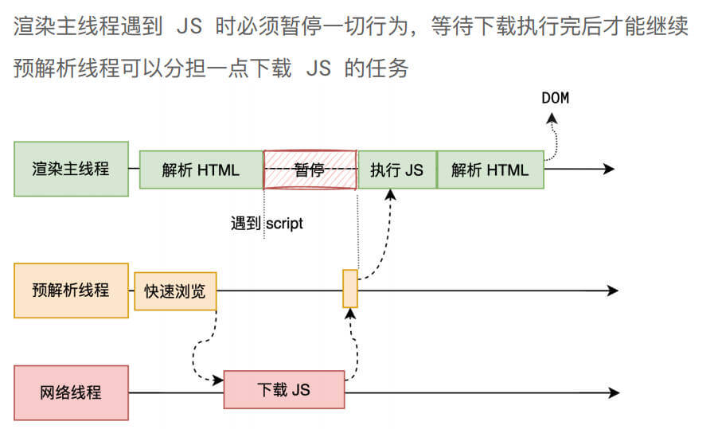
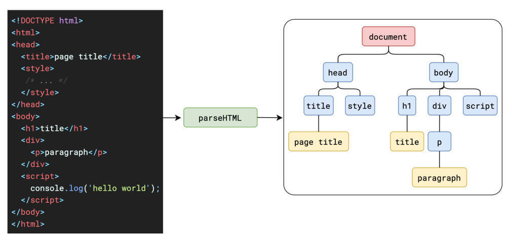
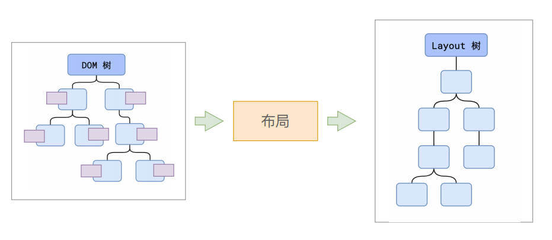
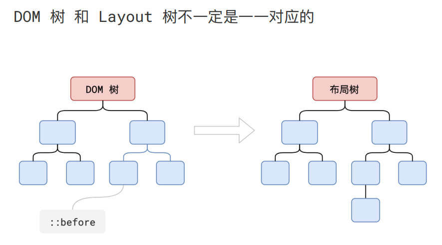
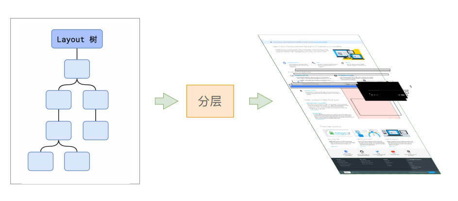

# 浏览器渲染原理

## 浏览器是如何渲染页面的?

当浏览器的网络线程收到`HTML`文档后，会产生一个渲染任务，并将其传递给渲染主线程的消息队列.

在事件循环机制的作用下，渲染主线程取出消息队列中的渲染任务，开启渲染流程.

整个渲染流程分为多个阶段

分别是：HTML 解析、样式计算、布局、分层、绘制、分块、光栅化、画

每个阶段都有明确的输入输出，上一个阶段的输出会成为下一个阶段的输入.

这样，整个渲染流程就形成了一套组织严密的生产流水线.
<Line title="渲染流⽔线" position="center"></Line>

## 第一步 **解析 HTML**

> 完成后，会得到`DOM`树和`CSSOM`树，浏览器的默认样式、内部样式、外部样式、行内样式均会包含在 _CSSOM_ 树中.

<Line title="解析 HTML - Parse HTML" position="center"></Line>

<Line title="HTML 解析过程中遇到 CSS 代码怎么办? " position="center"></Line>

解析过程中遇到`CSS`解析`CSS`，遇到`JS`执行`JS`.  
为了提高解析效率，浏览器在开始解析前，会启动一个预解析的线程，率先下载`HTML`中的外部`CSS`文件和 外部的`JS`文件.  
如果主线程解析到`link元素`位置，此时外部的`CSS`文件还没有下载解析好，主线程不会等待，  
继续解析后续的`HTML`. 这是因为下载和解析`CSS`的工作是在预解析线程中进行的. 这就是`CSS`不会阻塞`HTML`解析的根本原因.
<Line title="HTML 解析过程中遇到 JS 代码怎么办? " position="center"></Line>

如果主线程解析到`script`位置，会停止解析`HTML`，转而等待`JS`文件下载好，并将全局代码解析执行完成后，才能继续解析`HTML`.  
这是因为 JS 代码的执行过程可能会修改当前的`DOM`树，所以`DOM`树的生成必须暂停. 这就是`JS`会阻塞`HTML`解析的根本原因.

<Line title=" 解析 HTML | Document Object Model" position="center"></Line>

<Line title="解析 HTML | CSS Object Model" position="center"></Line>

## 第二步 **样式计算**

> 完成后，会得到一棵带有样式的`DOM`树.

<Line title="样式计算 - Recalculate Style" position="center"></Line>

主线程会遍历得到的`DOM`树，依次为树中的每个节点计算出它最终的样式，称之为 _Computed Style_.

在这一过程中，很多预设值会变成绝对值，比如`red`会变成`rgb(255,0,0)`；相对单位会变成绝对单位，比如`em`会变成`px`.

## 第三步 **布局**

> 完成后得到布局树

<Line title="布局 - Layout" position="center"></Line>

布局阶段会依次遍历`DOM`树的每一个节点，计算每个节点的几何信息. 例如节点的宽高、相对包含块的位置.

<Line title="布局 | DOM 树 和 Layout 树" position="center"></Line>

> 大部分时候，`DOM`树和布局树并非一一对应.

`display:none`的节点没有几何信息，因此不会生成到布局树

使用了伪元素选择器，虽然`DOM`树中不存在这些伪元素节点，但它们拥有几何信息，所以会生成到布局树中.

匿名行盒、匿名块盒等等都会导致`DOM`树和布局树无法一一对应.

## 第四步 **分层**

> 这个在 chrome 控制台中 点击三个点 -> more tools -> Layers可以看到

<Line title="分层 - Layer" position="center"></Line>

主线程会使用一套复杂的策略对整个布局树中进行分层.

分层的好处在于，将来某一个层改变后，仅会对该层进行后续处理，从而提升效率.

`滚动条`、`堆叠上下文`、`transform`、`opacity`等样式都会或多或少的影响分层结果，也可以通过`will-change`属性更大程度的影响分层结果.

## 第五步 **绘制**

<Line title="绘制 - Paint" position="center"></Line>

主线程会为每个层单独产生绘制指令集，用于描述这一层的内容该如何画出来.

<Line title="绘制 | 合成线程" position="center"></Line>

完成绘制后，主线程将每个图层的绘制信息提交给合成线程，剩余工作将由合成线程完成.

## 第六步 **分块**

> 会优先绘制距离视口位置近(在视口内)的块

<Line title="分块 - Tiling" position="center"></Line>

合成线程首先对每个图层进行分块，将其划分为更多的小区域.

<Line title="分块 | 多个线程同时进⾏" position="center"></Line>

它会从线程池中拿取多个线程来完成分块工作.

## 第七步 **光栅化**

> 光栅化的结果，就是一块一块的位图

<Line title="光栅化 - Raster" position="center"></Line>

合成线程会将块信息交给`GPU`进程，以极高的速度完成光栅化.
<Line title="光栅化 | GPU 加速" position="center"></Line>

`GPU`进程会开启多个线程来完成光栅化，并且优先处理靠近视口区域的块.

## 第八步 **画**

<Line title="画 - Draw" position="center"></Line>

合成线程拿到每个层、每个块的位图后，生成一个个 _指引(quad)_ 信息.

指引会标识出每个位图应该画到屏幕的哪个位置，以及会考虑到旋转、缩放等变形.

变形发生在合成线程，与渲染主线程无关，这就是`transform`效率高的本质原因.

合成线程会把`quad`提交给`GPU`进程，由`GPU`进程产生系统调用，提交给`GPU`硬件，完成最终的屏幕成像.

## 完整过程

> 这个过程是一只在不停重复的 比如说滚动了一滚动条 会重新触发`paint`重新绘制

<Line title="完整过程" position="center"></Line>

## 什么是 reflow?

> reflow 的本质就是重新计算 layout 树.

<Line title="什么是 reflow? " position="center"></Line>

当进行了会影响布局树的操作后，需要重新计算布局树，会引发`layout`.

为了避免连续的多次操作导致布局树反复计算，浏览器会合并这些操作，当 JS 代码全部完成后再进行统一计算. 所以，改动属性造成的`reflow`是异步完成的.

也同样因为如此，当`JS`获取布局属性时，就可能造成无法获取到最新的布局信息.

浏览器在反复权衡下，最终决定获取属性立即`reflow`.

## 什么是 repaint?

> repaint 的本质就是重新根据分层信息计算了绘制指令.

<Line title="什么是 repaint? " position="center"></Line>

当改动了可见样式后，就需要重新计算，会引发`repaint`.

由于元素的布局信息也属于可见样式，所以`reflow`一定会引起`repaint`.

## 为什么 transform 的效率高?

<Line title="为什么 transform 的效率高? " position="center"></Line>

因为`transform`既不会影响布局也不会影响绘制指令，它影响的只是渲染流程的最后一个 _draw_ 阶段

由于 draw 阶段在合成线程中，所以`transform`的变化几乎不会影响渲染主线程. 反之，渲染主线程无论如何忙碌，也不会影响`transform`的变化.
