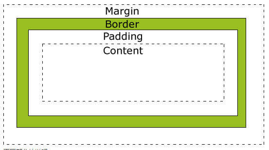
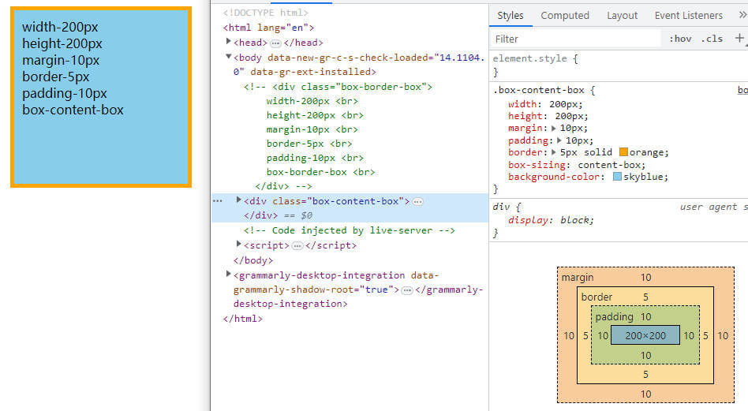

# 盒模型

> box：盒子, 每个元素在页面中都会生成一个矩形区域（盒子）

## 盒子类型

1.  行盒: `display` 等于 `inline` 的元素
2.  块盒: `display` 等于 `block` 的元素

行盒在页面中不换行、块盒独占一行

display 默认值为 inline

浏览器默认样式表设置的块盒：容器元素、h1~h6、p

常见的行盒：span、a、img、video、audio

## 盒子的组成部分

> 无论是行盒、还是块盒, 都由下面几个部分组成, 从内到外分别是：

- 内容 content
- 填充(内边距) padding
- 边框 border
- 外边距 margin

## box-sizing 的两种设置

> 现在主流浏览器有两种盒模型

1. `content-box`(默认)
2. `border-box`(MDN 推荐) [MDN box-sizing](https://developer.mozilla.org/zh-CN/docs/Web/CSS/box-sizing)

下面是他们的不同

这边盒子的大小就是当前 `content` 的大小

这边盒子的大小就是当前 `content` + `padding` + `border` 的大小
