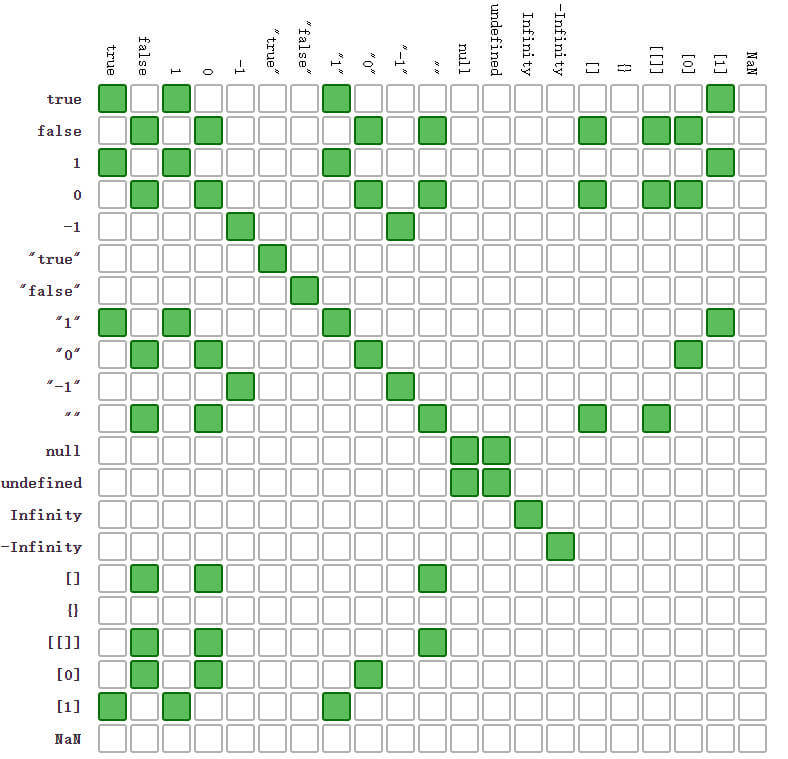

# 44 变态题

当初笔者做这套题的时候不仅怀疑智商, 连人生都开始怀疑了....

不过, 对于基础知识的理解是深入编程的前提. 让我们一起来看看这些变态题到底变态不变态吧!

## 第 1 题

```javascript
["1", "2", "3"].map(parseInt);
```

<span class="cor-wa">答案</span> <span class="cor-tip"> [1, NaN, NaN]</span>

[解析 传送门](/js/base/littleCase#_1-2-3-map-parseint)

## 第 2 题

```javascript
[typeof null, null instanceof Object];
```

两个知识点:

- [typeof](https://developer.mozilla.org/zh-CN/docs/Web/JavaScript/Reference/Operators/typeof)
- [instanceof](https://developer.mozilla.org/zh-CN/docs/Web/JavaScript/Reference/Operators/instanceof)

typeof 返回一个表示类型的字符串.  
[typeof 结果列表](/js/base/dataType#typeof)  
instanceof 运算符用来检测 constructor.prototype 是否存在于参数 object 的原型链上.
[instanceof 结果列表](/js/base/dataType#instanceof)

> `typeof null === 'object'` 是因为`js`存储对象（二进制）的时候使用`000`来开头，但是`null`的所有位都是`0`所以`typeof`判断时候将其判断成 `object`了

<span class="cor-wa">答案</span> <span class="cor-tip"> [object, false]</span>

## 第 3 题

```javascript
[[3, 2, 1].reduce(Math.pow), [].reduce(Math.pow)];
```

知识点:

- [Array/Reduce](https://developer.mozilla.org/zh-CN/docs/Web/JavaScript/Reference/Global_Objects/Array/Reduce)

`arr.reduce(callback[, initialValue])`

reduce 接受两个参数, 一个回调, 一个初始值.

回调函数接受四个参数 `previousValue, currentValue, currentIndex, array`

需要注意的是： [TypeError](https://developer.mozilla.org/zh-CN/docs/Web/JavaScript/Reference/Global_Objects/Array/Reduce#%E5%BC%82%E5%B8%B8)

所以第二个表达式会报异常.  
第一个表达式等价于 `Math.pow(3, 2) => 9; Math.pow(9, 1) =>9`

<span class="cor-wa">答案</span> <span class="cor-da">caught TypeError: Reduce of empty array with no initial value</span>

## 第 4 题

```javascript
var val = "flag";
console.log("Value is " + (val === "flag") ? "Something" : "Nothing");
```

两个知识点:

- [运算符优先级](https://developer.mozilla.org/zh-CN/docs/Web/JavaScript/Reference/Operators/Operator_Precedence)
- [条件（三元）运算符](https://developer.mozilla.org/zh-CN/docs/Web/JavaScript/Reference/Operators/Conditional_Operator)

简而言之 `+` 的优先级 大于 `?`

所以原题等价于 `'Value is true' ? 'Something' : 'Nothing'`  
而不是 `'Value is' + (true ? 'Something' : 'Nothing')`

<span class="cor-wa">答案</span> <span class="cor-tip">'Something'</span>

## 第 5 题

```javascript
var name = "World!";
(function () {
  if (typeof name === "undefined") {
    var name = "Jack";
    console.log("Goodbye " + name);
  } else {
    console.log("Hello " + name);
  }
})();
```

这个相对简单, 一个知识点:

- [Hoisting（变量提升）](https://developer.mozilla.org/zh-CN/docs/Glossary/Hoisting)

在 JavaScript 中， functions 和 variables 会被提升。  
变量提升是 JavaScript 将声明移至作用域 scope (全局域或者当前函数作用域) 顶部的行为。

这个题目相当于

```javascript
var name = "World!";
(function () {
  var name;
  if (typeof name === "undefined") {
    name = "Jack";
    console.log("Goodbye " + name);
  } else {
    console.log("Hello " + name);
  }
})();
```

<span class="cor-wa">答案</span> <span class="cor-tip">'Goodbye Jack'</span>

## 第 6 题

```javascript
var END = Math.pow(2, 53);
var START = END - 100;
var count = 0;
for (var i = START; i <= END; i++) {
  count++;
}
console.log(count);
```

一个知识点:

- [Infinity](https://developer.mozilla.org/zh-CN/docs/Web/JavaScript/Reference/Global_Objects/Infinity)

在 JS 里, <span class="cor-tip">Math.pow(2, 53) == 9007199254740992</span> 是可以表示的最大值. 最大值加一还是最大值. 所以循环不会停.

> js 中可以表示的最大整数不是 2 的 53 次方
>
> 而是 <span class="cor-wa">Number.MAX_VALUE = 1.7976931348623157e+308</span>
>
> 2 的 53 次方不是 js 能表示的最大整数而应该是能`正确计算且不失精度`的最大整数
>
> 也就是 <span class="cor-tip">Number.MAX_SAFE_INTEGER + 1 = 9007199254740991 + 1</span>
> 9007199254740992 +1 还是 9007199254740992 ，这就是因为精度问题  
> 如果 9007199254740992 + 11 或者 9007199254740992 + 111 的话，值是会发生改变的，只是这时候计算的结果不是正确的值，因为精度丢失。

<span class="cor-wa">答案</span> <span class="cor-da">死循环</span>

## 第 7 题

```javascript
var ary = [0, 1, 2];
ary[10] = 10;
ary.filter(function (x) {
  return x === undefined;
});
```

看一篇文章理解稀疏数组

- [译 JavaScript 中的稀疏数组与密集数组](http://www.cnblogs.com/ziyunfei/archive/2012/09/16/2687165.html)
- [Array/filter](https://developer.mozilla.org/zh-CN/docs/Web/JavaScript/Reference/Global_Objects/Array/filter)

我们来看一下 Array.prototype.filter 的 polyfill:

```javascript
if (!Array.prototype.filter) {
  Array.prototype.filter = function (fun /*, thisArg*/) {
    "use strict";

    if (this === void 0 || this === null) {
      throw new TypeError();
    }

    var t = Object(this);
    var len = t.length >>> 0;
    if (typeof fun !== "function") {
      throw new TypeError();
    }

    var res = [];
    var thisArg = arguments.length >= 2 ? arguments[1] : void 0;
    for (var i = 0; i < len; i++) {
      if (i in t) {
        // 注意这里!!!
        var val = t[i];
        if (fun.call(thisArg, val, i, t)) {
          res.push(val);
        }
      }
    }

    return res;
  };
}
```

我们看到在迭代这个数组的时候, 首先检查了这个索引值是不是数组的一个属性, 那么我们测试一下.

```JavaScript
0 in ary; => true
3 in ary; => false
10 in ary; => true
```

也就是说 从 3 - 9 都是没有 <span class="cor-wa">初始化</span> 的<span class="cor-da">坑</span>!, 这些索引并不存在与数组中. 在 `array` 的函数调用的时候是会跳过这些<span class="cor-da">坑</span>的.

<span class="cor-wa">答案</span> <span class="cor-tip">[]</span>

## 第 8 题

```JavaScript
var one   = 0.1
var two   = 0.2
var eight = 0.8
var six   = 0.6
[two - one == one, eight - six == two]
```

js 使用的是 [IEEE 二进制浮点数算术标准（IEEE 754）](https://zh.wikipedia.org/wiki/IEEE_754)  
IEEE 754 标准中的浮点数并 <span class="cor-da">不能</span> 精确地表达小数

那什么时候精准, 什么时候不精准呢?

其实在 js 中有一个复杂的运算过程 简单解释的话可以这样

首先用到了这个方法 [toPrecision 返回数值对象的指定精度字符串](https://developer.mozilla.org/zh-CN/docs/Web/JavaScript/Reference/Global_Objects/Number/toPrecision)

先看这个代码

::: details 前 17 个小数位

<div v-for="(item,index) in 17">
  <span>({{index/10}}).toPrecision(24) = </span>
  <span>{{(index / 10).toPrecision(24)}}</span>
</div>
:::

从这个结果看 `0 0.5 1 1.5` 这样的数据存储是精确的 所以

```javascript
0.2 + 0.3 === 0.5; // true
0.7 + 0.8 === 1.5; // true
```

然后 `0.2 - 0.1`

```javascript
0.2 - 0.1 === 0.1; // true
```

> 0.1 后面有个 `5551115` 多出来
>
> 0.2 后面有个 `11102230` 多出来

首先查看一下这个数值关系 0.2 的**偏差**正好是 0.1 的两倍

这就有意思了

那我们将 0.1 的 **偏差值** 记作 **+σ** `σ` 读作 `sigma`  
那么 0.2 的 就是 **+2σ**

`0.2 - 0.1` => **+2σ** - **+σ** 等于 **+σ**

但是 js 解释器认为一个 **+σ** 忽略不计 就相等了

然后 `0.2 + 0.1`

```javascript
0.2 + 0.1 === 0.3; // false
```

0.2 + 0.1 => **+2σ** + **+σ** 等于 **+3σ**了。

js 解释器认为 **+3σ** 就不能忽略其存在了，所以就不相等了

在看一个例子 `0.2 + 0.3`

> `0.3` 在数值上看起来是  
>  少了一个 0.3 - 0.299999999999999988897770 -> 11102230 记作 **-2σ**

```javascript
0.2 + 0.3 === 0.5; // true
```

`0.2 + 0.3` => **+2σ** + **-2σ** 正好抵消了

js 解释器这时候就爽了 直接就相等了

然后再看这个 `0.1 + 0.2 + 0.6`

> `0.6` 在数值上看起来是  
>  少了一个 0.6 - 0.599999999999999977795540 -> 22204460 记作 **-4σ**

```javascript
0.1 + 0.2 + 0.6 === 0.9; // true
```

`0.1 + 0.2 + 0.6` => **+σ** + **+2σ** + **-4σ** = **+σ**

**+σ** 忽略

再加

```javascript
0.1 + 0.2 + 0.6 + 0.1 === 1.0; // true
```

`0.1 + 0.2 + 0.6 + 0.1` => **+σ** + **+2σ** + **-4σ** + **+σ** = 0

当出现 0 时候 直接就 平了  
也就是说 如果出现 1.4 + 0.1 这样的  
按理说 1.4 应该记作 **-8σ** 在加 **+σ** 应该还有 **-7σ**
但是 js 处理了之后就平了

因为出现了 `0.5 1 1.5` 这样的能 二进制除尽的存在

```javascript
0.1 + 0.2 + 0.6 + 0.1 + 0.1 === 1.1; // +σ true
0.1 + 0.2 + 0.6 + 0.1 + 0.1 + 1.1 === 1.2; // +2σ false
```

要看哪个浮点数是几个偏差这个东西咋看呢

其实你看看 `0.1 0.2 0.8 1.6` 然后再看看 `0.3(0.2的基友) 0.7(0.8的基友)` 就大概能明白一些了

<span class="cor-wa">答案</span> <span class="cor-tip">[true, false]</span>

## 第 9 题

```JavaScript
function showCase(value) {
    switch(value) {
    case 'A':
        console.log('Case A');
        break;
    case 'B':
        console.log('Case B');
        break;
    case undefined:
        console.log('undefined');
        break;
    default:
        console.log('Do not know!');
    }
}
showCase(new String('A'));
```

两个知识点:

- [switch](https://developer.mozilla.org/zh-CN/docs/Web/JavaScript/Reference/Statements/switch)
- [String](https://developer.mozilla.org/zh-CN/docs/Web/JavaScript/Reference/Global_Objects/String)

switch 是严格比较 也就是 `===`, String 实例和 字符串不一样.

```JavaScript
var str = 'foo';
var obj = new String(str);

console.log(typeof str); // "string"
console.log(typeof obj);  // "object"
console.log(str === obj); // false
```

<span class="cor-wa">答案</span> <span class="cor-tip">'Do not know!'</span>

## 第 10 题

```JavaScript
function showCase2(value) {
    switch(value) {
    case 'A':
        console.log('Case A');
        break;
    case 'B':
        console.log('Case B');
        break;
    case undefined:
        console.log('undefined');
        break;
    default:
        console.log('Do not know!');
    }
}
showCase2(String('A'));
```

还是刚才的知识点, 只不过 String 不仅是个构造函数 直接调用返回一个字符串哦.

<span class="cor-wa">答案</span> <span class="cor-tip">'Case A'</span>

## 第 11 题

```JavaScript
function isOdd(num) {
    return num % 2 == 1;
}
function isEven(num) {
    return num % 2 == 0;
}
function isSane(num) {
    return isEven(num) || isOdd(num);
}
var values = [7, 4, '13', -9, Infinity];
values.map(isSane);
```

一个知识点

- [Remainder](https://developer.mozilla.org/en-US/docs/Web/JavaScript/Reference/Operators/Remainder)

此题等价于

```JavaScript
7 % 2 => 1
4 % 2 => 0
'13' % 2 => 1
-9 % % 2 => -1
Infinity % 2 => NaN
```

需要注意的是 余数的正负号随第一个操作数.

<span class="cor-wa">答案</span> <span class="cor-tip">[true, true, true, false, false]</span>

## 第 12 题

```JavaScript
parseInt(3, 8)
parseInt(3, 2)
parseInt(3, 0)
```

第一题讲过了

<span class="cor-wa">答案</span> <span class="cor-tip">3, NaN, 3</span>

## 第 13 题

```JavaScript
Array.isArray( Array.prototype )
```

一个知识点:

- [Array/prototype](https://developer.mozilla.org/zh-CN/docs/Web/JavaScript/Reference/Global_Objects/Array/@@iterator)

一个鲜为人知的实事: `Array.prototype => [xxxxx]`;

<span class="cor-wa">答案</span> <span class="cor-tip">true</span>

## 第 14 题

```JavaScript
var a = [0];
if ([0]) {
  console.log(a == true);
} else {
  console.log("wut");
}
```

来个双等号判别


解析:

- `Boolean([0]) === true`
- [0] == true

  - true 转换为数字 => 1
  - [0] 转化为数字失败, 转化为字符串 '0', 转化成数字 => 0
  - 0 !== 1

<span class="cor-wa">答案</span> <span class="cor-tip">false</span>

## 第 15 题

```JavaScript
[]==[]
```

[] 是 Object, 两个 Object 不相等

<span class="cor-wa">答案</span> <span class="cor-tip">false</span>

## 第 16 题

```JavaScript
'5' + 3
'5' - 3
```

两个知识点:

- [加法(+)](https://developer.mozilla.org/zh-CN/docs/Web/JavaScript/Reference/Operators/Addition)
- [减法(-)](https://developer.mozilla.org/zh-CN/docs/Web/JavaScript/Reference/Operators/Subtraction)

`+` 用来表示两个数的和或者字符串拼接, `-`表示两数之差.

请看例子, 体会区别:

```JavaScript
> '5' + 3
'53'
> 5 + '3'
'53'
> 5 - '3'
2
> '5' - 3
2
> '5' - '3'
2
```

也就是说 `-` 会尽可能的将两个操作数变成数字, 而 `+` 如果两边不都是数字, 那么就是字符串拼接.

<span class="cor-wa">答案</span> <span class="cor-tip">'53', 2</span>

## 第 17 题

```JavaScript
1 + - + + + - + 1
```

这里应该是(倒着看)

```JavaScript
1 + (a)  => 2
a = - (b) => 1
b = + (c) => -1
c = + (d) => -1
d = + (e) => -1
e = + (f) => -1
f = - (g) => -1
g = + 1   => 1
```

<span class="cor-wa">答案</span> <span class="cor-tip">2</span>

## 第 18 题

```JavaScript
var ary = Array(3);
ary[0]=2
ary.map(function(elem) { return '1'; });
```

稀疏数组. 同第 7 题.

题目中的数组其实是一个长度为 3, 但是没有内容的数组, array 上的操作会跳过这些未初始化的'坑'.

<span class="cor-wa">答案</span> <span class="cor-tip">["1", undefined × 2]</span>

这里贴上 Array.prototype.map 的 polyfill.

```JavaScript
Array.prototype.map = function(callback, thisArg) {

        var T, A, k;

        if (this == null) {
            throw new TypeError(' this is null or not defined');
        }

        var O = Object(this);
        var len = O.length >>> 0;
        if (typeof callback !== 'function') {
            throw new TypeError(callback + ' is not a function');
        }
        if (arguments.length > 1) {
            T = thisArg;
        }
        A = new Array(len);
        k = 0;
        while (k < len) {
            var kValue, mappedValue;
            if (k in O) {
                kValue = O[k];
                mappedValue = callback.call(T, kValue, k, O);
                A[k] = mappedValue;
            }
            k++;
        }
        return A;
    };
```

## 第 19 题

```JavaScript
function sidEffecting(ary) {
  ary[0] = ary[2];
}
function bar(a,b,c) {
  c = 10
  sidEffecting(arguments);
  return a + b + c;
}
bar(1,1,1)
```

这是一个大坑, 尤其是涉及到 ES6 语法的时候

知识点:

- [Arguments 对象](https://developer.mozilla.org/zh-CN/docs/Web/JavaScript/Reference/Functions/arguments)

arguments 对象是所有（非箭头）函数中都可用的局部变量。你可以使用 arguments 对象在函数中引用函数的参数。此对象包含传递给函数的每个参数，第一个参数在索引 0 处。例如，如果一个函数传递了三个参数

也就是说 `arguments` 是一个 `object`, c 就是 arguments[2], 所以对于 c 的修改就是对 arguments[2] 的修改.

<span class="cor-wa">答案</span> <span class="cor-tip">21</span>

然而!!!!!!

当非严格模式中的函数有包含剩余参数、默认参数和解构赋值，那么 arguments 对象中的值不会跟踪参数的值（反之亦然）。

请看:

```JavaScript
function sidEffecting(ary) {
  ary[0] = ary[2];
}
function bar(a,b,c=3) {
  c = 10
  sidEffecting(arguments);
  return a + b + c;
}
bar(1,1,1)
```

<span class="cor-wa">答案</span> <span class="cor-tip">12</span> !!!!

请读者细细体会!!

## 第 20 题

```javascript
var a = 111111111111111110000,
  b = 1111;
a + b;
```

<span class="cor-wa">答案</span> 还是 <span class="cor-tip">111111111111111110000</span>

原因是 因为 <span class="cor-da">111111111111111110000 > Number.MAX_SAFE_INTEGER(9007199254740991)</span> 了 在这个程度上在做计算 精度已经丢失了所以计算就已经不准确了

详细一些的原因是

```javascript
(111111111111111110000).toString(2).length; // 67
Number.MAX_SAFE_INTEGER.toString(2).length; // 53
(1111).toString(2).length; // 11
// 正常情况53位以后得数据js解释器已经不记录了
(67 - 53 = 14) > 11
// 理论上 在14位(2进制) 以内的数据 跟第一行做+运算都是会被舍弃掉的
```

## 第 21 题

```javascript
var x = [].reverse;
x();
```

这个题有意思!

知识点:

- [Array.prototype.reverse](https://developer.mozilla.org/zh-CN/docs/Web/JavaScript/Reference/Global_Objects/Array/reverse)

注意 `reverse 方法反转数组中元素的位置，改变了数组，并返回该数组的引用。`

也就是说 最后会返回这个调用者(this), 可是 当 x 执行的时候是上下文不是数组了而是是全局. 那么最后返回的应该是 `window`.

但是在浏览器调用的时候应该是对 this 做了检查 毕竟 this 不是数组的时候豪斯不能调用 reverse 方法的

<span class="cor-wa">答案</span> <span class="cor-da">TypeError: Cannot convert undefined or null to object</span>

## 第 22 题

```javascript
Number.MIN_VALUE > 0;
```

> MIN_VALUE 属性是 JavaScript 中可表示的最小的数（接近 0 ，但不是负数），它的近似值为 5 x 10-324。

<span class="cor-wa">答案</span> <span class="cor-tip">true</span>

## 第 23 题

```javascript
[1 < 2 < 3, 3 < 2 < 1];
```

这个题也还可以.

这个题会让人误以为是 `2 > 1 && 2 < 3` 其实不是的.

这个题等价于

```javascript
 1 < 2 => true;
 true < 3 =>  1 < 3 => true;
 3 < 2 => false;
 false < 1 => 0 < 1 => true;
```

<span class="cor-wa">答案</span> <span class="cor-tip">[true, true]</span>

## 第 24 题

```javascript
// the most classic wtf
2 == [[[2]]];
```

双等号的判断基本上基于这个原则

1. 等号两边`数据类型相同`的时候比较 <span class="cor-tip">值</span>
2. 两端都是`原始数据类型`的时候，<span class="cor-tip">转换成数字</span>比较
3. 一端是`原始类型`一端是`对象类型`，将 <span class="cor-tip">对象类型转换成原始数据类型</span> 再比较
4. `undefined` 和 `null` 只有跟自己 或者相互比较的时候才是 <span class="cor-tip">true</span> 其他都是 <span class="cor-da">false</span>
5. 两端只要有一端出现 <span class="cor-wa">NaN</span> 一定是 <span class="cor-da">false</span>

这边明显是 适用(3) 先将 `[[[2]]]`转换成基础数据类型 使用

```javascript
[[[2]]].valueOf(); // [Array(1)]
```

结果还是引用数据类型
那就再使用

```javascript
[[[2]]].toString(); // '2'
```

此时两端已经转换成 <span class="cor-tip">2 == '2'</span> 适用(2) 转换成数字比较

<span class="cor-wa">答案</span> <span class="cor-tip">true</span>

再举个小例子更好明白

```javascript
"1,2" == [1, 2]; // true
"1, 2" == [1, 2]; // false
```

## 第 25 题

```javascript
3.toString()
3..toString()
3...toString()
```

这个题也挺逗, <span class="cor-wa">答案</span> <span class="cor-tip">error, '3', error</span>

你如果换一个写法就好理解

```javascript
var a = 3;
a.toString();
a..toString();
```

这个<span class="cor-wa">答案</span>是 <span class="cor-tip">'3', error</span>

为啥呢?

因为在 js 中 `1.1`, `1.`, `.1` 都是合法的数字. 那么在解析 `3.toString` 的时候这个 `.` 到底是属于这个数字还是函数调用呢? 只能是数字, 因为`3.`合法啊!

## 第 26 题

```javascript
(function () {
  var x = (y = 1);
})();
console.log(y);
console.log(x);
```

<span class="cor-wa">答案</span> <span class="cor-tip">1</span> <span class="cor-da">ReferenceError: x is not defined</span>

y 被赋值到全局. x 是局部变量. 所以打印 x 的时候会报 `ReferenceError`

## 第 27 题

```javascript
var a = /123/,
  b = /123/;
[a == b, a === b];
```

即使正则的字面量一致(你可以理解他们是一个 /123/ 的正则对象), 他们也不相等.

<span class="cor-wa">答案</span> <span class="cor-tip">[false, false]</span>

## 第 28 题

```javascript
var a = [1, 2, 3],
  b = [1, 2, 3],
  c = [1, 2, 4];
[a == b, a === b, a > c, a < c];
```

`a == b` 的判断从 [第二十四题](/js/AbnormalQ/44Q#第-24-题)  
`a === b` === 判断不用说 都是对象比较引用地址 不相同

判断 `a > c` 和 `a < c` 时候要转换成基础数据类型

**a.valueOf() = [1, 2, 3]** 继续 **a.toString() = "1,2,3"**  
**c.valueOf() = [1, 2, 4]** 继续 **c.toString() = "1,2,4"**

得到了基础数据之后 两个字符串 "1,2,3" 和 "1,2,4"  
他俩比大小比的是 <span class="cor-wa">字典表顺序(ASCII 码表)</span> 所以 <span class="cor-tip">'1,2,4' > '1,2,3' </span>

<span class="cor-wa">答案</span> <span class="cor-tip">[false, false, false, true]</span>

再举个好理解的例子

```javascript
({a:1}) > {b:2}  => false  // [!code --]
({a:1}) < {b:2}  => false  // [!code --]
({a:1}) == ({b:2})  => false  // [!code --]
({a:1}) >= ({b:2})  => true  // [!code ++]
({a:1}) <= ({b:2})  => true  // [!code ++]
```

因为 `{xxx}.toString() = '[object Object]'`

## 第 29 题

```javascript
var a = {};
var b = Object.prototype;
[a.prototype === b, Object.getPrototypeOf(a) === b];
```

知识点:

- [Object/getPrototypeOf](https://developer.mozilla.org/zh-CN/docs/Web/JavaScript/Reference/Global_Objects/Object/getPrototypeOf)

只有 Function 拥有一个 prototype 的属性. 所以 `a.prototype` 为 `undefined`.

而 `Object.getPrototypeOf(obj)` 返回一个具体对象的原型(该对象的内部`[[prototype]]`值)

<span class="cor-wa">答案</span> <span class="cor-tip">false, true</span>

## 第 30 题

```javascript
function f() {}
var a = f.prototype;
var b = Object.getPrototypeOf(f);
a === b;
```

f.prototype 是使用 new 创建的 f 实例的原型. 而 Object.getPrototypeOf 是 f 函数的原型.

请看:

```javascript
a === Object.getPrototypeOf(new f()); // true
b === Function.prototype; // true
```

<span class="cor-wa">答案</span> <span class="cor-tip">false</span>

## 第 31 题

```javascript
function foo() {}
var oldName = foo.name;
foo.name = "bar";
[oldName, foo.name];
```

知识点:

- [Function/name](https://developer.mozilla.org/zh-CN/docs/Web/JavaScript/Reference/Global_Objects/Function/name)

因为**函数的名字不可变**.

<span class="cor-wa">答案</span> <span class="cor-tip">['foo', 'foo']</span>

## 第 32 题

```javascript
"1 2 3".replace(/\d/g, parseInt);
```

知识点:

- [String/replace 指定一个函数作为参数](https://developer.mozilla.org/zh-CN/docs/Web/JavaScript/Reference/Global_Objects/String/replace#%E6%8F%8F%E8%BF%B0)

`str.replace(regexp|substr, newSubStr|function)`

如果 replace 函数传入的第二个参数是函数, 那么这个函数将接受如下参数

- match 首先是匹配的字符串
- p1, p2 .... 然后是正则的分组
- offset match 匹配的 index
- string 整个字符串

由于题目中的正则没有分组, 所以等价于问

```javascript
parseInt("1", 0);
parseInt("2", 2);
parseInt("3", 4);
```

<span class="cor-wa">答案</span> <span class="cor-tip">1, NaN, 3</span>

## 第 33 题

```javascript
function f() {}
var parent = Object.getPrototypeOf(f);
[
  f.name, // ?
  parent.name, // ?
  typeof eval(f.name), // ?
  typeof eval(parent.name), //  ?
];
```

<span class="cor-wa">答案</span> <span class="cor-tip">['f', ' ', 'function', 'undefined']</span>

这个<span class="cor-wa">答案</span>并不重要.....

这里第一小问和第三小问很简单不解释了.

这里 首先要知道 `parent === Function.prototype => true`

所以 `parent.name` 是 `' '`

`eval("") => undefined`

## 第 34 题

```javascript
var lowerCaseOnly = /^[a-z]+$/;
[lowerCaseOnly.test(null), lowerCaseOnly.test()];
```

知识点:

- [RegExp/test](https://developer.mozilla.org/zh-CN/docs/Web/JavaScript/Reference/Global_Objects/RegExp/test)

这里 test 函数会将参数转为字符串. `'nul'`, `'undefined'` 都是小写了所以

<span class="cor-wa">答案</span> <span class="cor-tip">[true, true]</span>

## 第 35 题

```javascript
[, , ,].join(", ");
```

`[,,,] => [undefined × 3]`

因为 javascript 在定义数组的时候允许最后一个元素后跟一个`,`, 所以这是个长度为三的稀疏数组(这是长度为三, 并没有 0, 1, 2 三个属性哦)

<span class="cor-wa">答案</span> <span class="cor-tip">", , "</span>

## 第 36 题

```javascript
var a = { class: "Animal", name: "Fido" };
a.class;
```

这个题比较流氓.. 因为是浏览器相关, `class`是个保留字(现在是个关键字了)

<span class="cor-wa">答案</span> <span class="cor-in">不重要</span>  
 重要的是自己在取属性名称的时候尽量避免保留字. 如果使用的话请加引号 `a['class']`

## 第 37 题

```javascript
var a = new Date("epoch");
console.log(a);
```

知识点:

- [Date](https://developer.mozilla.org/zh-CN/docs/Web/JavaScript/Reference/Global_Objects/Date)
- [Date/parse](https://developer.mozilla.org/zh-CN/docs/Web/JavaScript/Reference/Global_Objects/Date/parse)

简单来说, 如果调用 Date 的构造函数传入一个字符串的话需要符合规范, 即满足 Date.parse 的条件.

另外需要注意的是 如果格式错误 构造函数返回的仍是一个 Date 的实例 `Invalid Date`.

<span class="cor-wa">答案</span> <span class="cor-tip">Invalid Date</span>

## 第 38 题

```javascript
var a = Function.length,
  b = new Function().length;
a === b;
```

我们知道一个 `function(Function 的实例)`的 `length` 属性就是函数签名的`参数个数`

所以 b.length == 0.

另外 Function.length 定义为 从 1 开始计数

<span class="cor-wa">答案</span> <span class="cor-tip">false</span>

## 第 39 题

```javascript
var a = Date(0);
var b = new Date(0);
var c = new Date();
[a === b, b === c, a === c];
```

还是关于 Date 的题, 需要注意的是

- 如果不传参数等价于当前时间.
- 如果是函数调用 返回一个字符串.

<span class="cor-wa">答案</span> <span class="cor-tip">false, false, false</span>

## 第 40 题

```javascript
var min = Math.min(),
  max = Math.max();
min < max;
```

知识点:

- [Math/min](https://developer.mozilla.org/zh-CN/docs/Web/JavaScript/Reference/Global_Objects/Math/min)
- [Math/max](https://developer.mozilla.org/zh-CN/docs/Web/JavaScript/Reference/Global_Objects/Math/max)

有趣的是, Math.min 不传参数返回 `Infinity`, Math.max 不传参数返回 `-Infinity` 😆

<span class="cor-wa">答案</span> <span class="cor-tip">false</span>

## 第 41 题

```javascript
function captureOne(re, str) {
  var match = re.exec(str);
  return match && match[1];
}
var numRe = /num=(\d+)/gi,
  wordRe = /word=(\w+)/i,
  a1 = captureOne(numRe, "num=1"),
  a2 = captureOne(wordRe, "word=1"),
  a3 = captureOne(numRe, "NUM=2"),
  a4 = captureOne(wordRe, "WORD=2");
[a1 === a2, a3 === a4];
```

知识点:

- [RegExp/exec](https://developer.mozilla.org/zh-CN/docs/Web/JavaScript/Reference/Global_Objects/RegExp/exec)

通俗的讲

因为第一个正则有一个 g 选项 它会‘记忆’他所匹配的内容, 等匹配后他会从上次匹配的索引继续, 而第二个正则不会

举个例子

```javascript
var myRe = /ab*/g;
var str = "abbcdefabh";
var myArray;
while ((myArray = myRe.exec(str)) !== null) {
  var msg = "Found " + myArray[0] + ". ";
  msg += "Next match starts at " + myRe.lastIndex;
  console.log(msg);
}
// Found abb. Next match starts at 3
// Found ab. Next match starts at 9
```

所以 a1 = '1'; a2 = '1'; a3 = null; a4 = '2'

<span class="cor-wa">答案</span> <span class="cor-tip">[true, false]</span>

## 第 42 题

```javascript
var a = new Date("2023-05-08"),
  b = new Date(2023, 05, 08);
[a.getDay() === b.getDay(), a.getMonth() === b.getMonth()];
```

这个比较明显的原因就是月份不同导致的  
因为月份编号是从 0 开始的  
a 是 2023 年 5 月 8 号  
b 是 2023 年 6 月 8 号

- [getDay](https://developer.mozilla.org/zh-CN/docs/Web/JavaScript/Reference/Global_Objects/Date/getDay) 获取星期几
- [getMonth](https://developer.mozilla.org/zh-CN/docs/Web/JavaScript/Reference/Global_Objects/Date/getMonth) 获取月份

```javascript
a.getDay();
1;
b.getDay();
4;
a.getMonth();
4;
b.getMonth();
5;
```

都是套路!

<span class="cor-wa">答案</span> <span class="cor-tip">[false, false]</span>

## 第 43 题

```javascript
if ("http://giftwrapped.com/picture.jpg".match(".gif")) {
  ("a gif file");
} else {
  ("not a gif file");
}
```

知识点:

- [String/match](https://developer.mozilla.org/zh-CN/docs/Web/JavaScript/Reference/Global_Objects/String/match)

String.prototype.match 接受一个正则, 如果不是, 按照 `new RegExp(obj)` 转化. 所以 `.` 并不会转义 那么 `/gif` 就匹配了 /.gif/

<span class="cor-wa">答案</span> <span class="cor-tip">'a gif file'</span>

## 第 44 题

```javascript
function foo(a) {
  var a;
  return a;
}
function bar(a) {
  var a = "bye";
  return a;
}
[foo("hello"), bar("hello")];
```

在两个函数里, a 作为参数其实已经声明了, 所以 `var a; var a = 'bye'` 其实就是 `a; a ='bye'`

<span class="cor-wa">答案</span> <span class="cor-tip">['hello', 'bye']</span>

_EOF_
